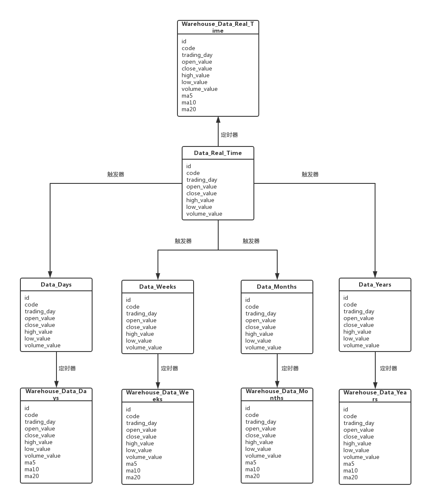

# 数据库表说明

## 数据库表

一共四张表：实时数据，日数据，周数据，月数据和年数据

- 实时数据：Data_Real_Time

|     字段名      |        类型         |   含义    |
| :----------: | :---------------: | :-----: |
|      id      |    NUMBER(30)     | 唯一标识，自增 |
|     code     | VARCHAR2(20 BYTE) |  股票代码   |
| trading_day  |       DATE        | 最后更新时间  |
|  open_value  |   NUMBER(30,10)   |   开盘价   |
| close_value  |   NUMBER(30,10)   |   收盘价   |
|  high_value  |   NUMBER(30,10)   |   最高价   |
|  low_value   |   NUMBER(30,10)   |   最低价   |
| volume_value |   NUMBER(30,10)   |   成交量   |

- 日数据：Data_Days

|     字段名      |        类型         |   含义    |
| :----------: | :---------------: | :-----: |
|      id      |    NUMBER(30)     | 唯一标识，自增 |
|     code     | VARCHAR2(20 BYTE) |  股票代码   |
| trading_day  |       DATE        | 最后更新时间  |
|  open_value  |   NUMBER(30,10)   |   开盘价   |
| close_value  |   NUMBER(30,10)   |   收盘价   |
|  high_value  |   NUMBER(30,10)   |   最高价   |
|  low_value   |   NUMBER(30,10)   |   最低价   |
| volume_value |   NUMBER(30,10)   |   成交量   |

- 周数据表：Data_Weeks

|     字段名      |        类型         |   含义    |
| :----------: | :---------------: | :-----: |
|      id      |    NUMBER(30)     | 唯一标识，自增 |
|     code     | VARCHAR2(20 BYTE) |  股票代码   |
| trading_day  |       DATE        | 最后更新时间  |
|  open_value  |   NUMBER(30,10)   |   开盘价   |
| close_value  |   NUMBER(30,10)   |   收盘价   |
|  high_value  |   NUMBER(30,10)   |   最高价   |
|  low_value   |   NUMBER(30,10)   |   最低价   |
| volume_value |   NUMBER(30,10)   |   成交量   |

- 月数据：Data_Months

|     字段名      |        类型         |   含义    |
| :----------: | :---------------: | :-----: |
|      id      |    NUMBER(30)     | 唯一标识，自增 |
|     code     | VARCHAR2(20 BYTE) |  股票代码   |
| trading_day  |       DATE        | 最后更新时间  |
|  open_value  |   NUMBER(30,10)   |   开盘价   |
| close_value  |   NUMBER(30,10)   |   收盘价   |
|  high_value  |   NUMBER(30,10)   |   最高价   |
|  low_value   |   NUMBER(30,10)   |   最低价   |
| volume_value |   NUMBER(30,10)   |   成交量   |

- 年数据：Data_Years

|     字段名      |        类型         |   含义    |
| :----------: | :---------------: | :-----: |
|      id      |    NUMBER(30)     | 唯一标识，自增 |
|     code     | VARCHAR2(20 BYTE) |  股票代码   |
| trading_day  |       DATE        | 最后更新时间  |
|  open_value  |   NUMBER(30,10)   |   开盘价   |
| close_value  |   NUMBER(30,10)   |   收盘价   |
|  high_value  |   NUMBER(30,10)   |   最高价   |
|  low_value   |   NUMBER(30,10)   |   最低价   |
| volume_value |   NUMBER(30,10)   |   成交量   |

## 数据仓库表

- 实时数据仓库：Warehouse_Data_Real_Time

|     字段名      |        类型         |   含义    |
| :----------: | :---------------: | :-----: |
|      id      |    NUMBER(30)     | 唯一标识，自增 |
|     code     | VARCHAR2(20 BYTE) |  股票代码   |
| trading_day  |       DATE        | 最后更新时间  |
|  open_value  |   NUMBER(30,10)   |   开盘价   |
| close_value  |   NUMBER(30,10)   |   收盘价   |
|  high_value  |   NUMBER(30,10)   |   最高价   |
|  low_value   |   NUMBER(30,10)   |   最低价   |
| volume_value |   NUMBER(30,10)   |   成交量   |

- 日数据仓库表：Warehouse_Data_Days

|     字段名      |        类型         |   含义    |
| :----------: | :---------------: | :-----: |
|      id      |    NUMBER(30)     | 唯一标识，自增 |
|     code     | VARCHAR2(20 BYTE) |  股票代码   |
| trading_day  |       DATE        | 最后更新时间  |
|  open_value  |   NUMBER(30,10)   |   开盘价   |
| close_value  |   NUMBER(30,10)   |   收盘价   |
|  high_value  |   NUMBER(30,10)   |   最高价   |
|  low_value   |   NUMBER(30,10)   |   最低价   |
| volume_value |   NUMBER(30,10)   |   成交量   |
|     ma5      |   NUMBER(30,10)   |  5日均价   |
|     ma10     |   NUMBER(30,10)   |  10日均价  |
|     ma20     |   NUMBER(30,10)   |  20日均价  |

- 周数据仓库表：Warehouse_Data_Weeks

|     字段名      |        类型         |   含义    |
| :----------: | :---------------: | :-----: |
|      id      |    NUMBER(30)     | 唯一标识，自增 |
|     code     | VARCHAR2(20 BYTE) |  股票代码   |
| trading_day  |       DATE        | 最后更新时间  |
|  open_value  |   NUMBER(30,10)   |   开盘价   |
| close_value  |   NUMBER(30,10)   |   收盘价   |
|  high_value  |   NUMBER(30,10)   |   最高价   |
|  low_value   |   NUMBER(30,10)   |   最低价   |
| volume_value |   NUMBER(30,10)   |   成交量   |
|     ma5      |   NUMBER(30,10)   |  5周均价   |
|     ma10     |   NUMBER(30,10)   |  10周均价  |
|     ma20     |   NUMBER(30,10)   |  20周均价  |

- 月数据仓库表：Warehouse_Data_Months

|     字段名      |        类型         |   含义    |
| :----------: | :---------------: | :-----: |
|      id      |    NUMBER(30)     | 唯一标识，自增 |
|     code     | VARCHAR2(20 BYTE) |  股票代码   |
| trading_day  |       DATE        | 最后更新时间  |
|  open_value  |   NUMBER(30,10)   |   开盘价   |
| close_value  |   NUMBER(30,10)   |   收盘价   |
|  high_value  |   NUMBER(30,10)   |   最高价   |
|  low_value   |   NUMBER(30,10)   |   最低价   |
| volume_value |   NUMBER(30,10)   |   成交量   |
|     ma5      |   NUMBER(30,10)   |  5月均价   |
|     ma10     |   NUMBER(30,10)   |  10月均价  |
|     ma20     |   NUMBER(30,10)   |  20月均价  |

- 年数据仓库表：Warehouse_Data_Years

|     字段名      |        类型         |   含义    |
| :----------: | :---------------: | :-----: |
|      id      |    NUMBER(30)     | 唯一标识，自增 |
|     code     | VARCHAR2(20 BYTE) |  股票代码   |
| trading_day  |       DATE        | 最后更新时间  |
|  open_value  |   NUMBER(30,10)   |   开盘价   |
| close_value  |   NUMBER(30,10)   |   收盘价   |
|  high_value  |   NUMBER(30,10)   |   最高价   |
|  low_value   |   NUMBER(30,10)   |   最低价   |
| volume_value |   NUMBER(30,10)   |   成交量   |

## 图



## 自增ID的使用

- 每个表都设置了序列，目的是实现自增ID，INSERT的时候要要注意ID的值要设置为**序列的下一个值**
- 每个表对应的序列即为：SEQ_表名
  - 如 DATA_DAYS表对应的序列为 SEQ_DATA_DAYS


- 使用示例：… 表示除ID外的其它值

  ```sql
  INSERT INTO 表名 VALUES(SEQ_表名.NEXTVAL, ...);
  INSERT INTO SEQ_DATA_DAYS VALUES(SEQ_DATA_DAYS.NEXTVAL, ...);
  ```

## 触发器

- 四个触发器，实时表更新后，触发日数据表、周数据表、月数据表、年数据表的更新

## 定时器

- 四个定时任务，每天定时插入新数据、每周定时插入新数据、以及每月、每年

## 测试表

- 测试数据表：ISTORICAL_QUOTES表

|     字段名      |        类型         |               含义                |
| :----------: | :---------------: | :-----------------------------: |
|     code     | VARCHAR2(10 BYTE) |              股票代码               |
| trading_day  |       DATE        |               日期                |
|  open_value  |   NUMBER(30,10)   |               开盘价               |
|  high_value  |   NUMBER(30,10)   |               最高价               |
| close_value  |   NUMBER(30,10)   |               收盘价               |
|  low_value   |   NUMBER(30,10)   |               最低价               |
| volume_value |   NUMBER(30,10)   |               成交量               |
| price_change |   NUMBER(30,10)   |          价格变动（当前画图不需要）          |
|   p_change   |   NUMBER(30,10)   |          涨跌幅（当前画图不需要）           |
|     ma5      |   NUMBER(30,10)   | 5日均价（可以直接读取就不用它的calculateMA函数）  |
|     ma10     |   NUMBER(30,10)   | 10日均价（可以直接读取就不用它的calculateMA函数） |
|     ma20     |   NUMBER(30,10)   | 20日均价（可以直接读取就不用它的calculateMA函数） |
|    v_ma5     |   NUMBER(30,10)   |         5日均量 （当前画图不需要）          |
|    v_ma10    |   NUMBER(30,10)   |         10日均量（当前画图不需要）          |
|    v_ma20    |   NUMBER(30,10)   |         20日均量（当前画图不需要）          |
|   turnover   |   NUMBER(30,10)   |         换手率 （画图不需要对应这个）         |

